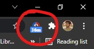
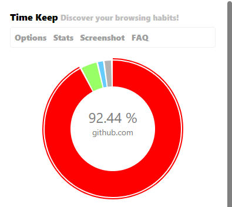
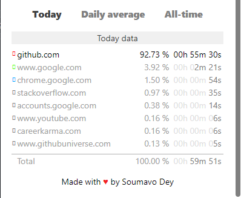
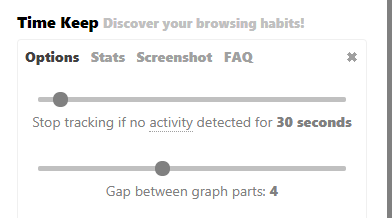
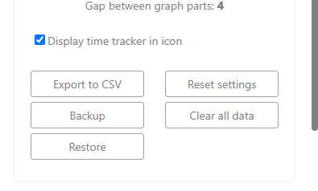
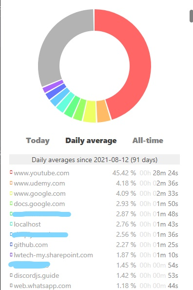
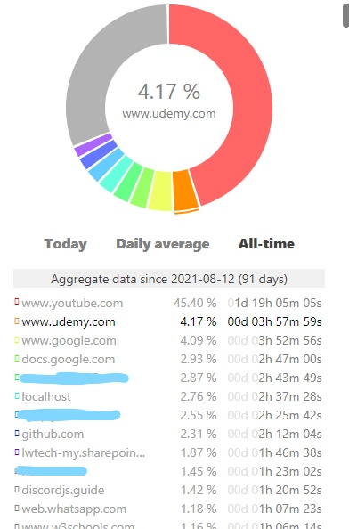
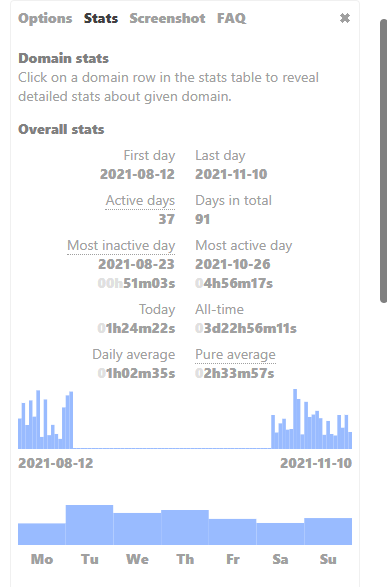
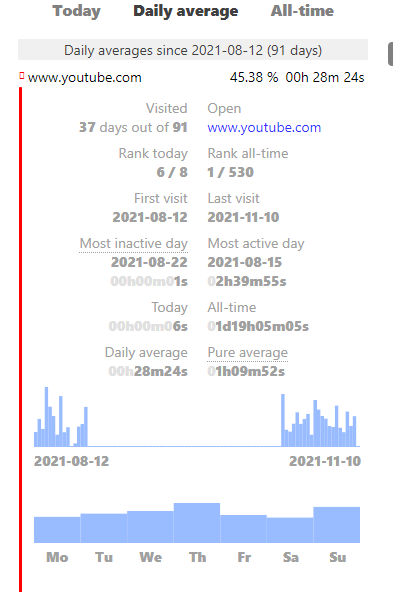
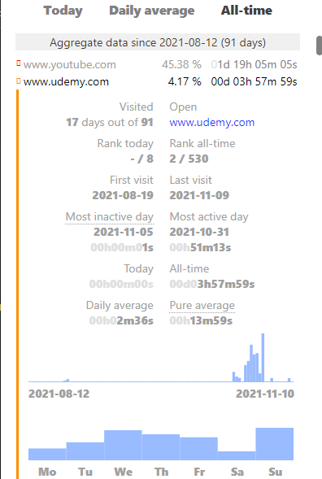

<h1>Time Keep </h1>
<b>Discover your browsing habits! Time tracking at its best.</b>

## Problems

It is near to impossible for a Google Chrome user to keep his/her browsing habits in track. 
<ul>
  <li>The Google Chrome Browser does not let its users to <b>view their uptime</b> on a single or multiple webpages.</li>
  <li>It also does not provide its users with any kind of <b>browsing stats</b> like most active day, or most inactive day of a user.</li>
  <li>There is also <b>no visual representation</b> like <b>Graphs</b> and <b>Pie Charts</b> of the user's browsing time data.</li>
</ul>

## Solution

So my approach to solve this above problem is by making a <b>Google Chrome Extension</b> named <b>"Time Keep"</b> which allows Chrome Users to keep track of time spent on specific webpages and also visually representing the data with Bar Diagram and Pie Charts. Also allowing the users to take screenshot of their stats or export the stats.

## Features

<ul>
  <li>Time spent on the present opened tab is shown on the Extension icon -</li>
  
  
 --------------------------- 

  <li>Included a pie chart displaying the ranking of webpages based on the time -</li>
   
    

  <li>Ranking websites based on the time they have been opened -</li>
  
    

  <li>On the <b>Options</b> tab, one can set the time limit of inactivity to stop the tracker. For example: if you have set the limit to 2 minutes, the extension will stop tracking your time spending on the website after you become inactive for 2 minutes on that particular webpage.
  
  One can set the gap between graph parts in pie chart -</li>
  
    

  <li>One can <b>Export data as CSV</b> or <b>Backup everything as a JSON file</b> and then can <b>Restore everything</b> from the JSON file.</li>
  
  <li>One can view the daily average data and the all time data-</li>
  
  <li>One can view the Overall Stats, the daily stats of specific webpage and the all time stats of a specific webpage -</li>
  
</ul>
